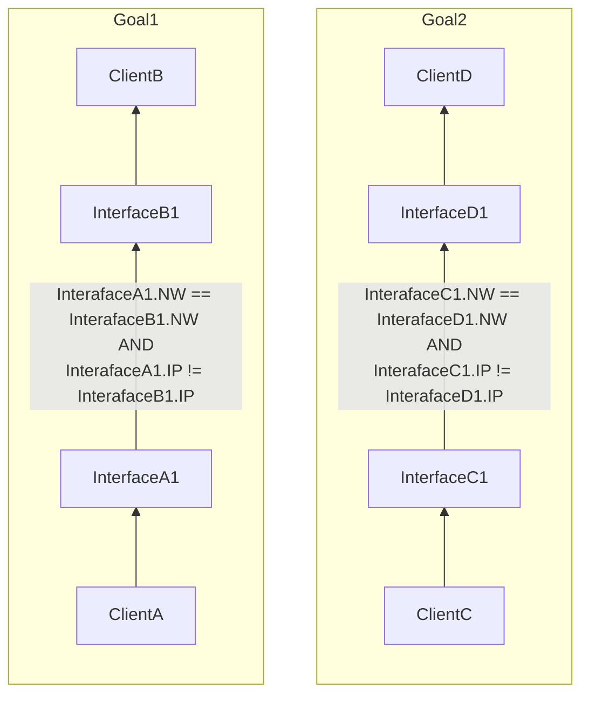
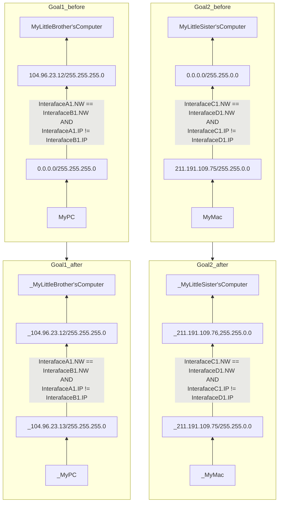

# level1

## Goal1
* ***InterfaceA1***と***InterfaceB1***のサブネットマスクが同一。
* IPアドレスのネットワークアドレスが一致し、且つ、ホストアドレスが異なるIPアドレスを***InterfaceA1***に設定する。

## Goal2
* ***InterfaceC1***と***InterfaceD1***のサブネットマスクが同一。
* IPアドレスのネットワークアドレスが一致し、且つ、ホストアドレスが異なるIPアドレスを***InterfaceD1***に設定する。

## chart

## example

