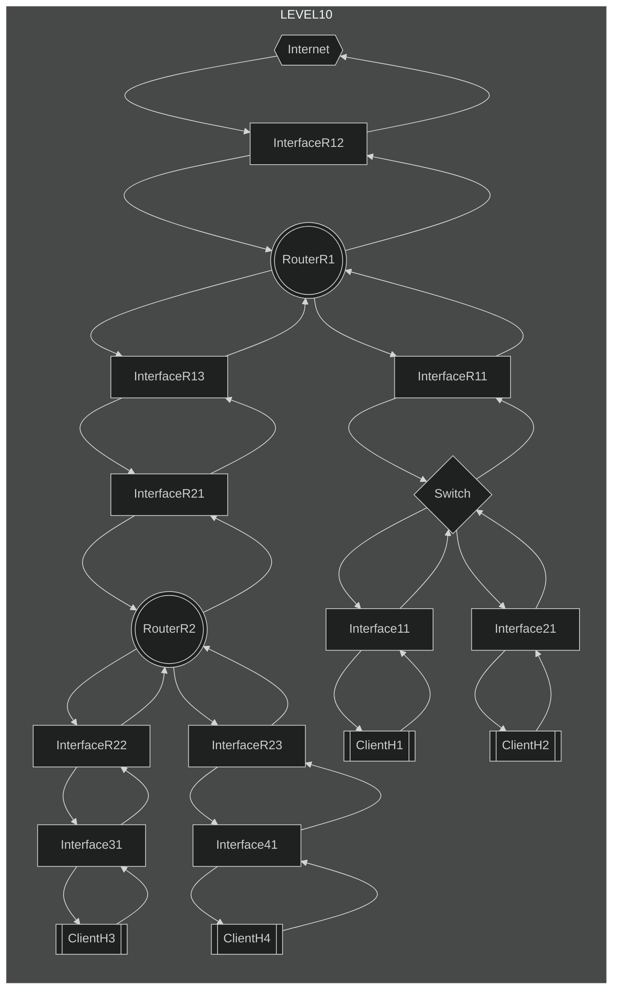

# level10

## Goal1
* ***InterfaceA1***,***InterfaceB1***のサブネットマスクを***InterfaceR11***のサブネットマスクに合わせる。（省略）

## chart

```mermaid
%%{init:{'theme': 'dark'}}%%
flowchart
subgraph LEVEL10
    direction TB
    NET{{Internet}}
    RR1(((RouterR1)))
    RR2(((RouterR2)))
    S{Switch}
    CH1[[ClientH1]]
    CH2[[ClientH2]]
    CH3[[ClientH3]]
    CH4[[ClientH4]]
    IH11[Interface11]
    IH21[Interface21]
    IH31[Interface31]
    IH41[Interface41]
    IR11[InterfaceR11]
    IR12[InterfaceR12]
    IR13[InterfaceR13]
    IR21[InterfaceR21]
    IR22[InterfaceR22]
    IR23[InterfaceR23]

    NET-->IR12-->RR1-->IR12-->NET
    CH3-->IH31-->IR22-->RR2-->IR21-->IR13-->RR1-->IR13-->IR21-->RR2-->IR23-->IH41-->CH4-->IH41-->IR23-->RR2-->IR22-->IH31-->CH3
    CH1-->IH11-->S-->IR11-->RR1-->IR11-->S-->IH21-->CH2-->IH21-->S-->IH11-->CH1
end
```

## example

```mermaid
%%{init:{'theme': 'dark'}}%%
flowchart

Goal7_before-->Goal7_after
subgraph Goal7_before
    direction TB
    G7_BE_NET{{Internet<br>0.0.0.0/0 => 163.172.250.12}}
    G7_BE_RR1(((RouterR1<br>0.0.0.0/0 => 166.76.48.253<br>166.76.48.128/26 => 166.76.48.253<br>0.0.0.0/0 => 163.172.250.1)))
    G7_BE_RR2(((RouterR2<br>0.0.0.0/0 => 166.76.48.254)))
    G7_BE_CL_H4[[ClientH4<br>default => 166.76.48.129]]
    G7_BE_IF_H41[166.76.48.131/255.255.255.192]
    G7_BE_IF_R12[163.172.250.12/255.255.255.240]
    G7_BE_IF_R13[166.76.48.254/0]
    G7_BE_IF_R21[166.76.48.253/255.255.255.252]
    G7_BE_IF_R23[0.0.0.0/0]
    G7_BE_CL_H4<-->G7_BE_IF_H41<-->G7_BE_IF_R23<-->G7_BE_RR2<-->G7_BE_IF_R21<-->G7_BE_IF_R13<-->G7_BE_RR1<-->G7_BE_IF_R12<-->G7_BE_NET
end

subgraph Goal7_after
    direction TB
    G7_AF_NET{{Internet<br>0.0.0.0/0 => 163.172.250.12}}
    G7_AF_RR1(((RouterR1<br>0.0.0.0/0 => 166.76.48.253<br>166.76.48.128/26 => 166.76.48.253<br>0.0.0.0/0 => 163.172.250.1)))
    G7_AF_RR2(((RouterR2<br>0.0.0.0/0 => 166.76.48.254)))
    G7_AF_CL_H4[[ClientH4<br>default => 166.76.48.129]]
    G7_AF_IF_H41[166.76.48.131/255.255.255.192]
    G7_AF_IF_R12[163.172.250.12/255.255.255.240]
    G7_AF_IF_R13[166.76.48.254/0]
    G7_AF_IF_R21[166.76.48.253/255.255.255.252]
    G7_AF_IF_R23[0.0.0.0/0]
    G7_AF_CL_H4<-->G7_AF_IF_H41<-->G7_AF_IF_R23<-->G7_AF_RR2<-->G7_AF_IF_R21<-->G7_AF_IF_R13<-->G7_AF_RR1<-->G7_AF_IF_R12<-->G7_AF_NET
end

Goal6_before-->Goal6_after
subgraph Goal6_before
    direction TB
    G6_BE_NET{{Internet<br>0.0.0.0/0 => 163.172.250.12}}
    G6_BE_RR1(((RouterR1<br>0.0.0.0/0 => 166.76.48.253<br>166.76.48.128/26 => 166.76.48.253<br>0.0.0.0/0 => 163.172.250.1)))
    G6_BE_RR2(((RouterR2<br>0.0.0.0/0 => 166.76.48.254)))
    G6_BE_CL_H3[[ClientH3<br>0.0.0.0/0 => 0.0.0.0]]
    G6_BE_IF_H31[0.0.0.0/0]
    G6_BE_IF_R12[163.172.250.12/255.255.255.240]
    G6_BE_IF_R13[166.76.48.254/0]
    G6_BE_IF_R21[166.76.48.253/255.255.255.252]
    G6_BE_IF_R22[0.0.0.0/0]
    G6_BE_CL_H3<-->G6_BE_IF_H31<-->G6_BE_IF_R22<-->G6_BE_RR2<-->G6_BE_IF_R21<-->G6_BE_IF_R13<-->G6_BE_RR1<-->G6_BE_IF_R12<-->G6_BE_NET
end

subgraph Goal6_after
    direction TB
    G6_AF_NET{{Internet<br>0.0.0.0/0 => 163.172.250.12}}
    G6_AF_RR1(((RouterR1<br>0.0.0.0/0 => 166.76.48.253<br>166.76.48.128/26 => 166.76.48.253<br>0.0.0.0/0 => 163.172.250.1)))
    G6_AF_RR2(((RouterR2<br>0.0.0.0/0 => 166.76.48.254)))
    G6_AF_CL_H3[[ClientH3<br>0.0.0.0/0 => 0.0.0.0]]
    G6_AF_IF_H31[0.0.0.0/0]
    G6_AF_IF_R12[163.172.250.12/255.255.255.240]
    G6_AF_IF_R13[166.76.48.254/0]
    G6_AF_IF_R21[166.76.48.253/255.255.255.252]
    G6_AF_IF_R22[0.0.0.0/0]
    G6_AF_CL_H3<-->G6_AF_IF_H31<-->G6_AF_IF_R22<-->G6_AF_RR2<-->G6_AF_IF_R21<-->G6_AF_IF_R13<-->G6_AF_RR1<-->G6_AF_IF_R12<-->G6_AF_NET
end


Goal5_before-->Goal5_after
subgraph Goal5_before
    direction TB
    G5_BE_RR1(((RouterR1<br>0.0.0.0/0 => 166.76.48.253<br>166.76.48.128/26 => 166.76.48.253<br>0.0.0.0/0 => 163.172.250.1)))
    G5_BE_RR2(((RouterR2<br>0.0.0.0/0 => 166.76.48.254)))
    G5_BE_S{Switch}
    G5_BE_CL_H2[[ClientH2<br>default => 166.76.48.1]]
    G5_BE_CL_H3[[ClientH3<br>0.0.0.0/0 => 0.0.0.0]]
    G5_BE_IF_H21[0.0.0.0/0]
    G5_BE_IF_H31[0.0.0.0/0]
    G5_BE_IF_R11[166.76.48.1/255.255.255.128]
    G5_BE_IF_R13[166.76.48.254/0]
    G5_BE_IF_R21[166.76.48.253/255.255.255.252]
    G5_BE_IF_R22[0.0.0.0/0]
    G5_BE_CL_H2<-->G5_BE_IF_H21<-->G5_BE_S<-->G5_BE_IF_R11<-->G5_BE_RR1<-->G5_BE_IF_R13<-->G5_BE_IF_R21<-->G5_BE_RR2<-->G5_BE_IF_R22<-->G5_BE_IF_H31<-->G5_BE_CL_H3
end

subgraph Goal5_after
    direction TB
    G5_AF_RR1(((RouterR1<br>0.0.0.0/0 => 166.76.48.253<br>166.76.48.128/26 => 166.76.48.253<br>0.0.0.0/0 => 163.172.250.1)))
    G5_AF_RR2(((RouterR2<br>0.0.0.0/0 => 166.76.48.254)))
    G5_AF_S{Switch}
    G5_AF_CL_H2[[ClientH2<br>default => 166.76.48.1]]
    G5_AF_CL_H3[[ClientH3<br>0.0.0.0/0 => 0.0.0.0]]
    G5_AF_IF_H21[0.0.0.0/0]
    G5_AF_IF_H31[0.0.0.0/0]
    G5_AF_IF_R11[166.76.48.1/255.255.255.128]
    G5_AF_IF_R13[166.76.48.254/0]
    G5_AF_IF_R21[166.76.48.253/255.255.255.252]
    G5_AF_IF_R22[0.0.0.0/0]
    G5_AF_CL_H2<-->G5_AF_IF_H21<-->G5_AF_S<-->G5_AF_IF_R11<-->G5_AF_RR1<-->G5_AF_IF_R13<-->G5_AF_IF_R21<-->G5_AF_RR2<-->G5_AF_IF_R22<-->G5_AF_IF_H31<-->G5_AF_CL_H3
end


Goal4_before-->Goal4_after
subgraph Goal4_before
    direction TB
    G4_BE_RR1(((RouterR1<br>0.0.0.0/0 => 166.76.48.253<br>166.76.48.128/26 => 166.76.48.253<br>0.0.0.0/0 => 163.172.250.1)))
    G4_BE_RR2(((RouterR2<br>0.0.0.0/0 => 166.76.48.254)))
    G4_BE_S{Switch}
    G4_BE_CL_H1[[ClientH1<br>0.0.0.0/0 => 166.76.48.1]]
    G4_BE_CL_H4[[ClientH4<br>default => 166.76.48.129]]
    G4_BE_IF_H11[166.76.48.2/0]
    G4_BE_IF_H41[166.76.48.131/255.255.255.192]
    G4_BE_IF_R11[166.76.48.1/255.255.255.128]
    G4_BE_IF_R13[166.76.48.254/0]
    G4_BE_IF_R21[166.76.48.253/255.255.255.252]
    G4_BE_IF_R23[0.0.0.0/0]
    G4_BE_CL_H1<-->G4_BE_IF_H11<-->G4_BE_S<-->G4_BE_IF_R11<-->G4_BE_RR1<-->G4_BE_IF_R13<-->G4_BE_IF_R21<-->G4_BE_RR2<-->G4_BE_IF_R23<-->G4_BE_IF_H41<-->G4_BE_CL_H4
end

subgraph Goal4_after
    direction TB
    G4_AF_RR1(((RouterR1<br>0.0.0.0/0 => 166.76.48.253<br>166.76.48.128/26 => 166.76.48.253<br>0.0.0.0/0 => 163.172.250.1)))
    G4_AF_RR2(((RouterR2<br>0.0.0.0/0 => 166.76.48.254)))
    G4_AF_S{Switch}
    G4_AF_CL_H1[[ClientH1<br>0.0.0.0/0 => 166.76.48.1]]
    G4_AF_CL_H4[[ClientH4<br>default => 166.76.48.129]]
    G4_AF_IF_H11[166.76.48.2/0]
    G4_AF_IF_H41[166.76.48.131/255.255.255.192]
    G4_AF_IF_R11[166.76.48.1/255.255.255.128]
    G4_AF_IF_R13[166.76.48.254/0]
    G4_AF_IF_R21[166.76.48.253/255.255.255.252]
    G4_AF_IF_R23[0.0.0.0/0]
    G4_AF_CL_H1<-->G4_AF_IF_H11<-->G4_AF_S<-->G4_AF_IF_R11<-->G4_AF_RR1<-->G4_AF_IF_R13<-->G4_AF_IF_R21<-->G4_AF_RR2<-->G4_AF_IF_R23<-->G4_AF_IF_H41<-->G4_AF_CL_H4
end


Goal3_before-->Goal3_after
subgraph Goal3_before
    direction TB
    G3_BE_NET{{Internet<br>0.0.0.0/0 => 163.172.250.12}}
    G3_BE_RR1(((RouterR1<br>0.0.0.0/0 => 166.76.48.253<br>166.76.48.128/26 => 166.76.48.253<br>0.0.0.0/0 => 163.172.250.1)))
    G3_BE_S{Switch}
    G3_BE_CL_H1[[ClientH1<br>0.0.0.0/0 => 166.76.48.1]]
    G3_BE_IF_H11[166.76.48.2/0]
    G3_BE_IF_R11[166.76.48.1/255.255.255.128]
    G3_BE_IF_R12[163.172.250.12/255.255.255.240]
    G3_BE_CL_H1<-->G3_BE_IF_H11<-->G3_BE_S<-->G3_BE_IF_R11<-->G3_BE_RR1<-->G3_BE_IF_R12<-->G3_BE_NET
end

subgraph Goal3_after
    direction TB
    G3_AF_NET{{Internet<br>0.0.0.0/0 => 163.172.250.12}}
    G3_AF_RR1(((RouterR1<br>0.0.0.0/0 => 166.76.48.253<br>166.76.48.128/26 => 166.76.48.253<br>0.0.0.0/0 => 163.172.250.1)))
    G3_AF_S{Switch}
    G3_AF_CL_H1[[ClientH1<br>0.0.0.0/0 => 166.76.48.1]]
    G3_AF_IF_H11[166.76.48.2/0]
    G3_AF_IF_R11[166.76.48.1/255.255.255.128]
    G3_AF_IF_R12[163.172.250.12/255.255.255.240]
    G3_AF_CL_H1<-->G3_AF_IF_H11<-->G3_AF_S<-->G3_AF_IF_R11<-->G3_AF_RR1<-->G3_AF_IF_R12<-->G3_AF_NET
end


Goal2_before-->Goal2_after
subgraph Goal2_before
    direction TB
    G2_BE_RR2(((RouterR2<br>0.0.0.0/0 => 166.76.48.254)))
    G2_BE_CL_H3[[ClientH3<br>0.0.0.0/0 => 0.0.0.0]]
    G2_BE_CL_H4[[ClientH4<br>default => 166.76.48.129]]
    G2_BE_IF_H31[0.0.0.0/0]
    G2_BE_IF_H41[166.76.48.131/255.255.255.192]
    G2_BE_IF_R22[0.0.0.0/0]
    G2_BE_IF_R23[0.0.0.0/0]
    G2_BE_CL_H3<-->G2_BE_IF_H31<-->G2_BE_IF_R22<-->G2_BE_RR2<-->G2_BE_IF_R23<-->G2_BE_IF_H41<-->G2_BE_CL_H4
end

subgraph Goal2_after
    direction TB
    G2_AF_RR2(((RouterR2<br>0.0.0.0/0 => 166.76.48.254)))
    G2_AF_CL_H3[[ClientH3<br>0.0.0.0/0 => 0.0.0.0]]
    G2_AF_CL_H4[[ClientH4<br>default => 166.76.48.129]]
    G2_AF_IF_H31[0.0.0.0/0]
    G2_AF_IF_H41[166.76.48.131/255.255.255.192]
    G2_AF_IF_R22[0.0.0.0/0]
    G2_AF_IF_R23[0.0.0.0/0]
    G2_AF_CL_H3<-->G2_AF_IF_H31<-->G2_AF_IF_R22<-->G2_AF_RR2<-->G2_AF_IF_R23<-->G2_AF_IF_H41<-->G2_AF_CL_H4
end


Goal1_before-->Goal1_after
subgraph Goal1_before
    direction TB
    G1_BE_S{Switch}
    G1_BE_CL_H1[[ClientH1<br>0.0.0.0/0 => 166.76.48.1]]
    G1_BE_CL_H2[[ClientH2<br>default => 166.76.48.1]]
    G1_BE_IF_H11[166.76.48.2/0]
    G1_BE_IF_H21[0.0.0.0/0]
    G1_BE_CL_H1<-->G1_BE_IF_H11<-->G1_BE_S<-->G1_BE_IF_H21<-->G1_BE_CL_H2
end

subgraph Goal1_after
    direction TB
    G1_AF_S{Switch}
    G1_AF_CL_H1[[ClientH1<br>0.0.0.0/0 => 166.76.48.1]]
    G1_AF_CL_H2[[ClientH2<br>default => 166.76.48.1]]
    G1_AF_IF_H11[166.76.48.2/0]
    G1_AF_IF_H21[0.0.0.0/0]
    G1_AF_CL_H1<-->G1_AF_IF_H11<-->G1_AF_S<-->G1_AF_IF_H21<-->G1_AF_CL_H2
end
```
