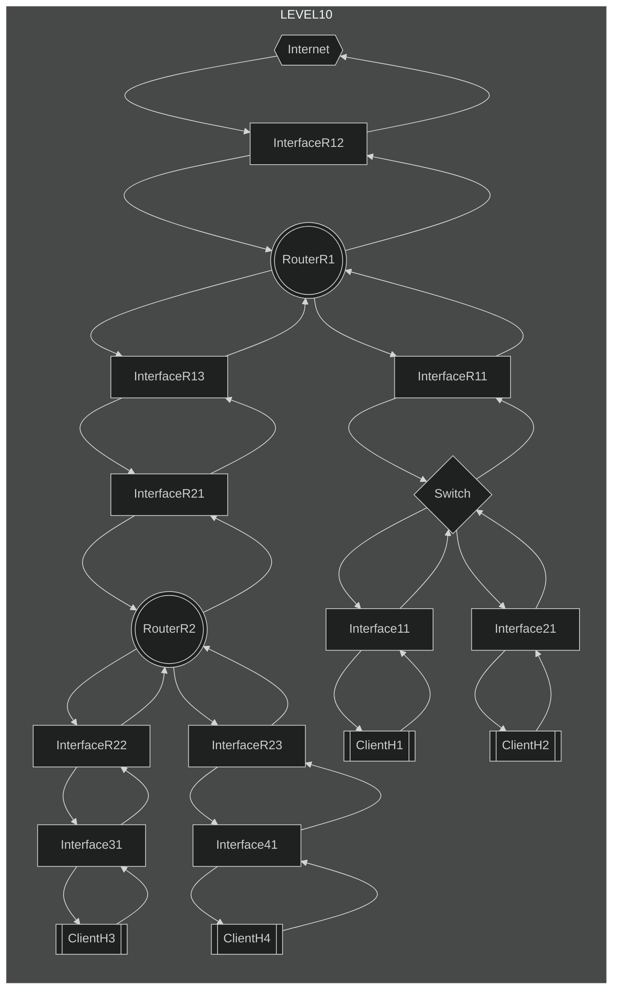

# level10

## Goal1
* ***InterfaceH11***,***InterfaceH21***のサブネットマスクを***InterfaceR11***のサブネットマスクに合わせる。（省略）
* ***InterfaceH21***のIPアドレスを***InterfaceH11***と同じネットワークアドレスで異なるホストアドレスとなるIPアドレスを設定する。

## Goal2
* ***InterfaceR23***に***ClientH4***のデフォルトルートに設定されているIPアドレスを設定し、サブネットマスクに***InterfaceH41***に設定されている値を設定する。
* ***InterfaceR22***と***InterfaceH31***のサブネットマスクに/30を設定する。(他の値でも良いが、隣接するネットワークと異なるネットワークアドレスを振りたいため)。第一オクテットから第三オクテットまでが同一で、第四オクテットが隣接するネットワークと異なるIPアドレスを設定する。
    * 使用不可能なIPアドレス
        * ***InterfaceR23***のサブネットが255.255.255.192でIPアドレスの第四オクテットのビット列が10から始まるので、上位２ビットが10となるIPアドレスは***NG***
        * ***InterfaceR13***が属するネットワークのサブネットが255.255.255.252でIPアドレスの第四オクテットのビット列が111111となっているため、上位6ビットが111111となるIPアドレスは***NG***
* ***ClientH3***のデフォルトルートを***InterfaceR22***のIPアドレスに設定する。

## Goal3
* ***Internet***のデフォルトルートの送り元アドレスに内部ネットワークのネットワーク全てに共通するもっとも大きいサブネットにしたネットワークアドレスを設定する。(***InterfaceH11***が属するネットワークと***InterfaceR23***が属するネットワークと***InterfaceR22***が属するネットワーク全てを網羅し、且つ、サブネットが最も大きくなるのはサブネットマスク値が/24の時)
* ***RouterR1***ルーティングテーブルの送り元アドレスに***InterfaceR22***が属するネットワークのネットワークアドレスとサブネットマスク値を設定する。

# Goal4
* ***InterfaceR13***のサブネットマスクを***InterfaceR21***のサブネットマスクと同じ値を設定する。

# Goal5,Goal6,Goal7
Goal1, Goal2, Goal3,Goal4を正しく設定できていればOK

## chart

## example

```mermaid
%%{init:{'theme': 'dark'}}%%
flowchart

Goal7_before-->Goal7_after
subgraph Goal7_before
    direction TB
    G7_BE_NET{{Internet<br>0.0.0.0/0 => 163.172.250.12}}
    G7_BE_RR1(((RouterR1<br>0.0.0.0/0 => 150.219.20.253<br>150.219.20.128/26 => 150.219.20.253<br>0.0.0.0/0 => 163.172.250.1)))
    G7_BE_RR2(((RouterR2<br>0.0.0.0/0 => 150.219.20.254)))
    G7_BE_CL_H4[[ClientH4<br>default => 150.219.20.129]]
    G7_BE_IF_H41[150.219.20.131/255.255.255.192]
    G7_BE_IF_R12[163.172.250.12/255.255.255.240]
    G7_BE_IF_R13[150.219.20.254/0]
    G7_BE_IF_R21[150.219.20.253/255.255.255.252]
    G7_BE_IF_R23[0.0.0.0/0]
    G7_BE_CL_H4<-->G7_BE_IF_H41<-->G7_BE_IF_R23<-->G7_BE_RR2<-->G7_BE_IF_R21<-->G7_BE_IF_R13<-->G7_BE_RR1<-->G7_BE_IF_R12<-->G7_BE_NET
end

subgraph Goal7_after
    direction TB
    G7_AF_NET{{Internet<br>150.219.20.194/24 => 163.172.250.12}}
    G7_AF_RR1(((RouterR1<br>150.219.20.194/30 => 150.219.20.253<br>150.219.20.128/26 => 150.219.20.253<br>0.0.0.0/0 => 163.172.250.1)))
    G7_AF_RR2(((RouterR2<br>0.0.0.0/0 => 150.219.20.254)))
    G7_AF_CL_H4[[ClientH4<br>default => 150.219.20.129]]
    G7_AF_IF_H41[150.219.20.131/255.255.255.192]
    G7_AF_IF_R12[163.172.250.12/255.255.255.240]
    G7_AF_IF_R13[150.219.20.254/30]
    G7_AF_IF_R21[150.219.20.253/255.255.255.252]
    G7_AF_IF_R23[150.219.20.129/26]
    G7_AF_CL_H4<-->G7_AF_IF_H41<-->G7_AF_IF_R23<-->G7_AF_RR2<-->G7_AF_IF_R21<-->G7_AF_IF_R13<-->G7_AF_RR1<-->G7_AF_IF_R12<-->G7_AF_NET
end

Goal6_before-->Goal6_after
subgraph Goal6_before
    direction TB
    G6_BE_NET{{Internet<br>0.0.0.0/0 => 163.172.250.12}}
    G6_BE_RR1(((RouterR1<br>0.0.0.0/0 => 150.219.20.253<br>150.219.20.128/26 => 150.219.20.253<br>0.0.0.0/0 => 163.172.250.1)))
    G6_BE_RR2(((RouterR2<br>0.0.0.0/0 => 150.219.20.254)))
    G6_BE_CL_H3[[ClientH3<br>0.0.0.0/0 => 0.0.0.0]]
    G6_BE_IF_H31[0.0.0.0/0]
    G6_BE_IF_R12[163.172.250.12/255.255.255.240]
    G6_BE_IF_R13[150.219.20.254/0]
    G6_BE_IF_R21[150.219.20.253/255.255.255.252]
    G6_BE_IF_R22[0.0.0.0/0]
    G6_BE_CL_H3<-->G6_BE_IF_H31<-->G6_BE_IF_R22<-->G6_BE_RR2<-->G6_BE_IF_R21<-->G6_BE_IF_R13<-->G6_BE_RR1<-->G6_BE_IF_R12<-->G6_BE_NET
end

subgraph Goal6_after
    direction TB
    G6_AF_NET{{Internet<br>150.219.20.194/24 => 163.172.250.12}}
    G6_AF_RR1(((RouterR1<br>150.219.20.194/30 => 150.219.20.253<br>150.219.20.128/26 => 150.219.20.253<br>0.0.0.0/0 => 163.172.250.1)))
    G6_AF_RR2(((RouterR2<br>0.0.0.0/0 => 150.219.20.254)))
    G6_AF_CL_H3[[ClientH3<br>0.0.0.0/0 => 150.219.20.194]]
    G6_AF_IF_H31[150.219.20.193/30]
    G6_AF_IF_R12[163.172.250.12/255.255.255.240]
    G6_AF_IF_R13[150.219.20.254/30]
    G6_AF_IF_R21[150.219.20.253/255.255.255.252]
    G6_AF_IF_R22[150.219.20.194/30]
    G6_AF_CL_H3<-->G6_AF_IF_H31<-->G6_AF_IF_R22<-->G6_AF_RR2<-->G6_AF_IF_R21<-->G6_AF_IF_R13<-->G6_AF_RR1<-->G6_AF_IF_R12<-->G6_AF_NET
end


Goal5_before-->Goal5_after
subgraph Goal5_before
    direction TB
    G5_BE_RR1(((RouterR1<br>0.0.0.0/0 => 150.219.20.253<br>150.219.20.128/26 => 150.219.20.253<br>0.0.0.0/0 => 163.172.250.1)))
    G5_BE_RR2(((RouterR2<br>0.0.0.0/0 => 150.219.20.254)))
    G5_BE_S{Switch}
    G5_BE_CL_H2[[ClientH2<br>default => 150.219.20.1]]
    G5_BE_CL_H3[[ClientH3<br>0.0.0.0/0 => 0.0.0.0]]
    G5_BE_IF_H21[0.0.0.0/0]
    G5_BE_IF_H31[0.0.0.0/0]
    G5_BE_IF_R11[150.219.20.1/255.255.255.128]
    G5_BE_IF_R13[150.219.20.254/0]
    G5_BE_IF_R21[150.219.20.253/255.255.255.252]
    G5_BE_IF_R22[0.0.0.0/0]
    G5_BE_CL_H2<-->G5_BE_IF_H21<-->G5_BE_S<-->G5_BE_IF_R11<-->G5_BE_RR1<-->G5_BE_IF_R13<-->G5_BE_IF_R21<-->G5_BE_RR2<-->G5_BE_IF_R22<-->G5_BE_IF_H31<-->G5_BE_CL_H3
end

subgraph Goal5_after
    direction TB
    G5_AF_RR1(((RouterR1<br>150.219.20.194/30 => 150.219.20.253<br>150.219.20.128/26 => 150.219.20.253<br>0.0.0.0/0 => 163.172.250.1)))
    G5_AF_RR2(((RouterR2<br>0.0.0.0/0 => 150.219.20.254)))
    G5_AF_S{Switch}
    G5_AF_CL_H2[[ClientH2<br>default => 150.219.20.1]]
    G5_AF_CL_H3[[ClientH3<br>0.0.0.0/0 => 150.219.20.194]]
    G5_AF_IF_H21[150.219.20.3/25]
    G5_AF_IF_H31[150.219.20.194/30]
    G5_AF_IF_R11[150.219.20.1/255.255.255.128]
    G5_AF_IF_R13[150.219.20.254/30]
    G5_AF_IF_R21[150.219.20.253/255.255.255.252]
    G5_AF_IF_R22[150.219.20.194/30]
    G5_AF_CL_H2<-->G5_AF_IF_H21<-->G5_AF_S<-->G5_AF_IF_R11<-->G5_AF_RR1<-->G5_AF_IF_R13<-->G5_AF_IF_R21<-->G5_AF_RR2<-->G5_AF_IF_R22<-->G5_AF_IF_H31<-->G5_AF_CL_H3
end


Goal4_before-->Goal4_after
subgraph Goal4_before
    direction TB
    G4_BE_RR1(((RouterR1<br>0.0.0.0/0 => 150.219.20.253<br>150.219.20.128/26 => 150.219.20.253<br>0.0.0.0/0 => 163.172.250.1)))
    G4_BE_RR2(((RouterR2<br>0.0.0.0/0 => 150.219.20.254)))
    G4_BE_S{Switch}
    G4_BE_CL_H1[[ClientH1<br>0.0.0.0/0 => 150.219.20.1]]
    G4_BE_CL_H4[[ClientH4<br>default => 150.219.20.129]]
    G4_BE_IF_H11[150.219.20.2/0]
    G4_BE_IF_H41[150.219.20.131/255.255.255.192]
    G4_BE_IF_R11[150.219.20.1/255.255.255.128]
    G4_BE_IF_R13[150.219.20.254/0]
    G4_BE_IF_R21[150.219.20.253/255.255.255.252]
    G4_BE_IF_R23[0.0.0.0/0]
    G4_BE_CL_H1<-->G4_BE_IF_H11<-->G4_BE_S<-->G4_BE_IF_R11<-->G4_BE_RR1<-->G4_BE_IF_R13<-->G4_BE_IF_R21<-->G4_BE_RR2<-->G4_BE_IF_R23<-->G4_BE_IF_H41<-->G4_BE_CL_H4
end

subgraph Goal4_after
    direction TB
    G4_AF_RR1(((RouterR1<br>150.219.20.194/30 => 150.219.20.253<br>150.219.20.128/26 => 150.219.20.253<br>0.0.0.0/0 => 163.172.250.1)))
    G4_AF_RR2(((RouterR2<br>0.0.0.0/0 => 150.219.20.254)))
    G4_AF_S{Switch}
    G4_AF_CL_H1[[ClientH1<br>0.0.0.0/0 => 150.219.20.1]]
    G4_AF_CL_H4[[ClientH4<br>default => 150.219.20.129]]
    G4_AF_IF_H11[150.219.20.2/225]
    G4_AF_IF_H41[150.219.20.131/255.255.255.192]
    G4_AF_IF_R11[150.219.20.1/255.255.255.128]
    G4_AF_IF_R13[150.219.20.254/30]
    G4_AF_IF_R21[150.219.20.253/255.255.255.252]
    G4_AF_IF_R23[150.219.20.129/26]
    G4_AF_CL_H1<-->G4_AF_IF_H11<-->G4_AF_S<-->G4_AF_IF_R11<-->G4_AF_RR1<-->G4_AF_IF_R13<-->G4_AF_IF_R21<-->G4_AF_RR2<-->G4_AF_IF_R23<-->G4_AF_IF_H41<-->G4_AF_CL_H4
end


Goal3_before-->Goal3_after
subgraph Goal3_before
    direction TB
    G3_BE_NET{{Internet<br>0.0.0.0/0 => 163.172.250.12}}
    G3_BE_RR1(((RouterR1<br>0.0.0.0/0 => 150.219.20.253<br>150.219.20.128/26 => 150.219.20.253<br>0.0.0.0/0 => 163.172.250.1)))
    G3_BE_S{Switch}
    G3_BE_CL_H1[[ClientH1<br>0.0.0.0/0 => 150.219.20.1]]
    G3_BE_IF_H11[150.219.20.2/0]
    G3_BE_IF_R11[150.219.20.1/255.255.255.128]
    G3_BE_IF_R12[163.172.250.12/255.255.255.240]
    G3_BE_CL_H1<-->G3_BE_IF_H11<-->G3_BE_S<-->G3_BE_IF_R11<-->G3_BE_RR1<-->G3_BE_IF_R12<-->G3_BE_NET
end

subgraph Goal3_after
    direction TB
    G3_AF_NET{{Internet<br>150.219.20.194/24 => 163.172.250.12}}
    G3_AF_RR1(((RouterR1<br>150.219.20.194/30 => 150.219.20.253<br>150.219.20.128/26 => 150.219.20.253<br>0.0.0.0/0 => 163.172.250.1)))
    G3_AF_S{Switch}
    G3_AF_CL_H1[[ClientH1<br>0.0.0.0/0 => 150.219.20.1]]
    G3_AF_IF_H11[150.219.20.2/25]
    G3_AF_IF_R11[150.219.20.1/255.255.255.128]
    G3_AF_IF_R12[163.172.250.12/255.255.255.240]
    G3_AF_CL_H1<-->G3_AF_IF_H11<-->G3_AF_S<-->G3_AF_IF_R11<-->G3_AF_RR1<-->G3_AF_IF_R12<-->G3_AF_NET
end


Goal2_before-->Goal2_after
subgraph Goal2_before
    direction TB
    G2_BE_RR2(((RouterR2<br>0.0.0.0/0 => 150.219.20.254)))
    G2_BE_CL_H3[[ClientH3<br>0.0.0.0/0 => 0.0.0.0]]
    G2_BE_CL_H4[[ClientH4<br>default => 150.219.20.129]]
    G2_BE_IF_H31[0.0.0.0/0]
    G2_BE_IF_H41[150.219.20.131/255.255.255.192]
    G2_BE_IF_R22[0.0.0.0/0]
    G2_BE_IF_R23[0.0.0.0/0]
    G2_BE_CL_H3<-->G2_BE_IF_H31<-->G2_BE_IF_R22<-->G2_BE_RR2<-->G2_BE_IF_R23<-->G2_BE_IF_H41<-->G2_BE_CL_H4
end

subgraph Goal2_after
    direction TB
    G2_AF_RR2(((RouterR2<br>0.0.0.0/0 => 150.219.20.254)))
    G2_AF_CL_H3[[ClientH3<br>0.0.0.0/0 => 150.219.20.194]]
    G2_AF_CL_H4[[ClientH4<br>default => 150.219.20.129]]
    G2_AF_IF_H31[150.219.20.193/30]
    G2_AF_IF_H41[150.219.20.131/255.255.255.192]
    G2_AF_IF_R22[150.219.20.194/30]
    G2_AF_IF_R23[150.219.20.129/26]
    G2_AF_CL_H3<-->G2_AF_IF_H31<-->G2_AF_IF_R22<-->G2_AF_RR2<-->G2_AF_IF_R23<-->G2_AF_IF_H41<-->G2_AF_CL_H4
end


Goal1_before-->Goal1_after
subgraph Goal1_before
    direction TB
    G1_BE_S{Switch}
    G1_BE_CL_H1[[ClientH1<br>0.0.0.0/0 => 150.219.20.1]]
    G1_BE_CL_H2[[ClientH2<br>default => 150.219.20.1]]
    G1_BE_IF_H11[150.219.20.2/0]
    G1_BE_IF_H21[0.0.0.0/0]
    G1_BE_CL_H1<-->G1_BE_IF_H11<-->G1_BE_S<-->G1_BE_IF_H21<-->G1_BE_CL_H2
end

subgraph Goal1_after
    direction TB
    G1_AF_S{Switch}
    G1_AF_CL_H1[[ClientH1<br>0.0.0.0/0 => 150.219.20.1]]
    G1_AF_CL_H2[[ClientH2<br>default => 150.219.20.1]]
    G1_AF_IF_H11[150.219.20.2/25]
    G1_AF_IF_H21[150.219.20.3/25]
    G1_AF_CL_H1<-->G1_AF_IF_H11<-->G1_AF_S<-->G1_AF_IF_H21<-->G1_AF_CL_H2
end
```

