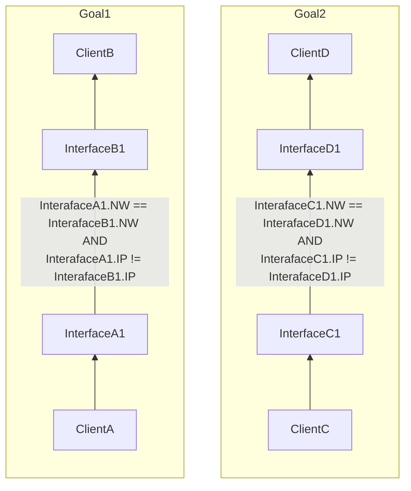
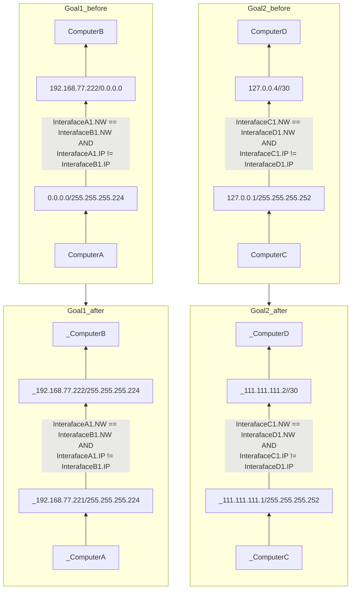

# level2

## Goal1
* ***InterfaceB1***と***InterfaceA1***のサブネットマスクが違うため、サブネットマスクを揃える。（サブネットを揃えなくても良いが説明は省略）
* IPアドレスのネットワークアドレスが一致し、且つ、ホストアドレスが異なるIPアドレスを***InterfaceA1***に設定する。

## Goal2
* ***InterfaceC1***と***InterfaceD1***のサブネットマスクが同一。（/30のような書き方はサブネットマスクの短絡記法）
* IPアドレスのネットワークアドレスが一致し、且つ、ホストアドレスが異なるIPアドレスを***InterfaceC1***と***InterfaceD1***に設定する。（127.0.0.*というIPアドレスはループバックアドレスであるため使用できない）

## chart

## example

