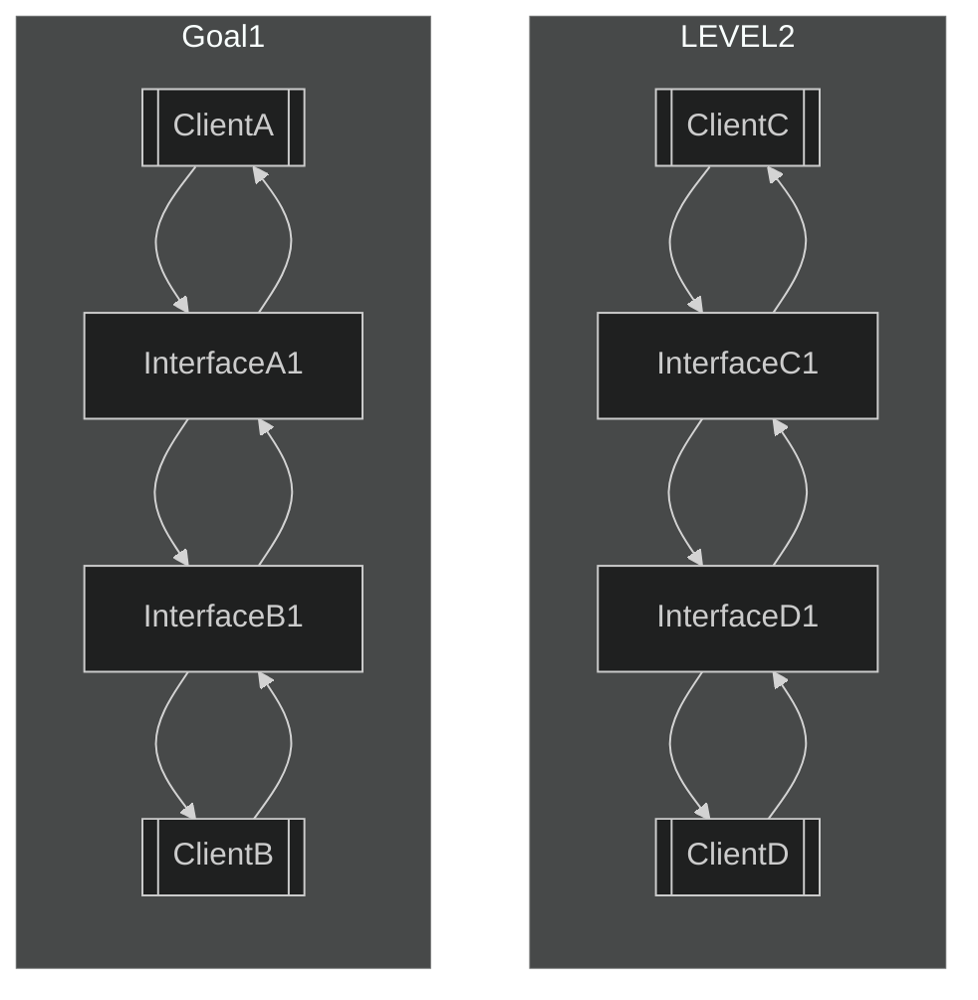
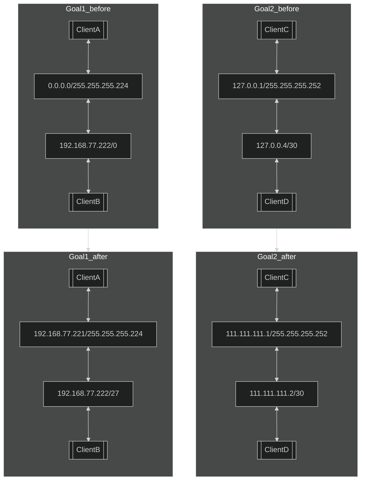

# level2

## How to solve
### Goal1
* ***InterfaceB1***と***InterfaceA1***のサブネットマスクが違うため、サブネットマスクを揃える。（必ずしもサブネットを揃える必要はないが説明は省略）
* IPアドレスのネットワーク部が一致し、且つ、ホスト部が異なるIPアドレスを***InterfaceA1***に設定する。

### Goal2
* ***InterfaceC1***と***InterfaceD1***のサブネットマスクが同一。（/30のような書き方はサブネットマスクのCIDR表記）
* IPアドレスのネットワーク部が一致し、且つ、ホスト部が異なるIPアドレスを***InterfaceC1***と***InterfaceD1***に設定する。（127.0.0.*というIPアドレスはループバックアドレスであるため使用できない）

## chart

## example

