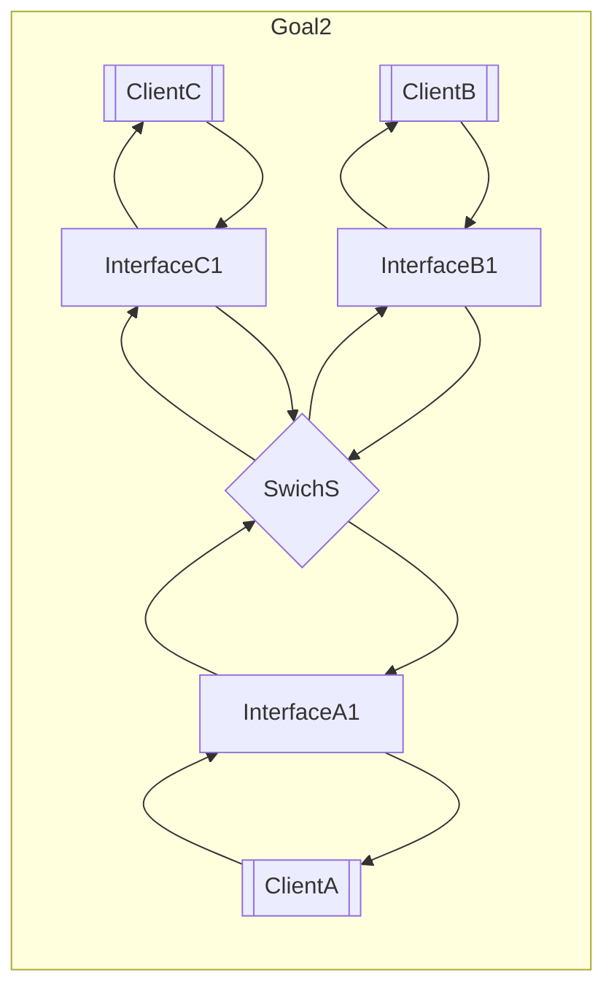
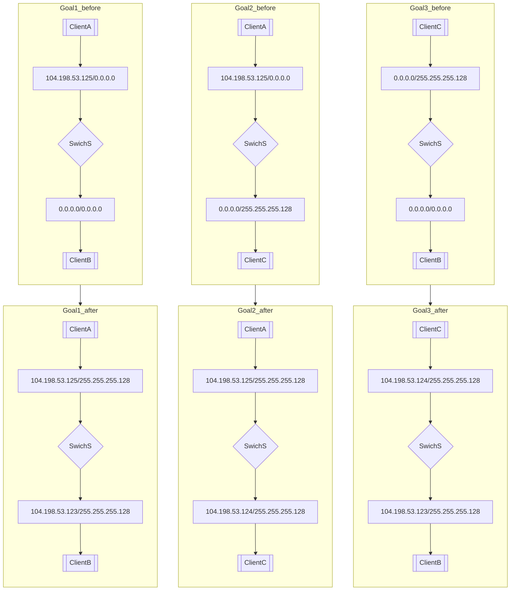

# level3

## Goal1
* ***InterfaceA1***と***InterfaceB1***のサブネットマスクがセットされていないため、値がセットされている***InterfaceC1***のサブネットマスク に合わせる。（省略）
* 既にIPアドレスが設定されている***InterfaceA1***とネットワークアドレスは一致し、ホストアドレスが異なるIPアドレスを***InterfaceB1***に設定する。

## Goal2
* 既にIPアドレスが設定されている***InterfaceA1***とネットワークアドレスは一致し、ホストアドレスが異なるIPアドレスを***InterfaceC1***に設定する。

## Goal3
* Goal1とGoal2の設定が競合しないようなIPアドレスを調整する。

## chart

## example

