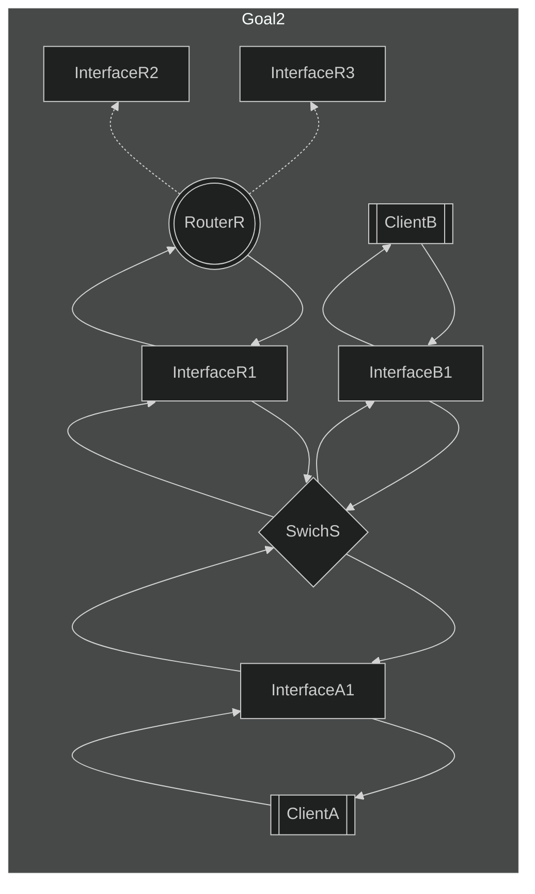
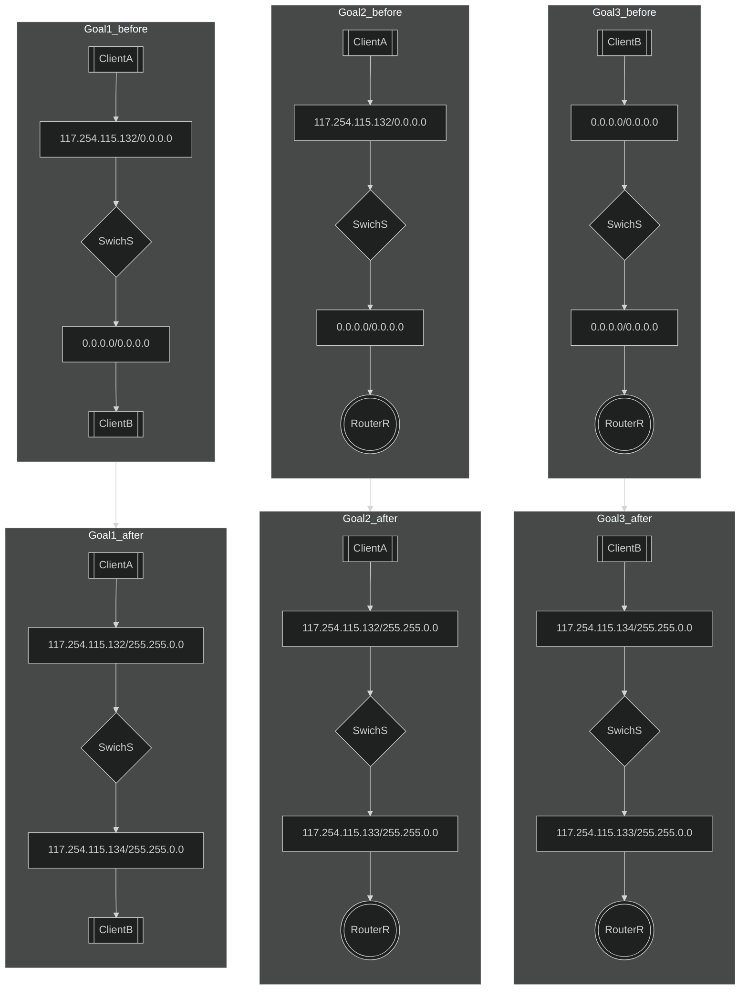

# level4

## Goal1
* ***InterfaceA1***と***InterfaceB1***と***InterfaceR1***のサブネットマスクがセットされていないため、適当なサブネットマスクを設定する。（省略）
* 既にIPアドレスが設定されている***InterfaceA1***とネットワークアドレスは一致し、ホストアドレスが異なるIPアドレスを***InterfaceB1***に設定する。

## Goal2
* 既にIPアドレスが設定されている***InterfaceA1***とネットワークアドレスは一致し、ホストアドレスが異なるIPアドレスを***InterfaceR1***に設定する。

## Goal3
* ***InterfaceR2***と***InterfaceR3***と（***InterfaceA1***,***InterfaceB1***,***InterfaceR1***）のネットワークアドレスが異なり、且つ、***InterfaceA1***と***InterfaceB1***と***InterfaceR1***のネットワークアドレスが同一、且つ、ホストアドレスが異なるIPアドレスに調節する。

## chart

## example

