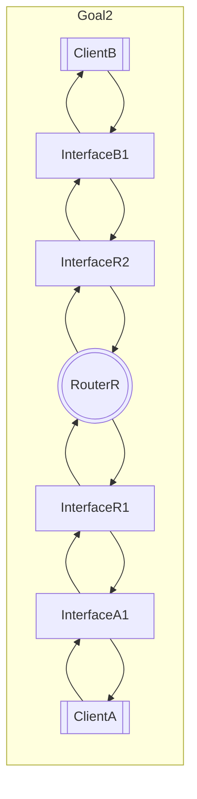
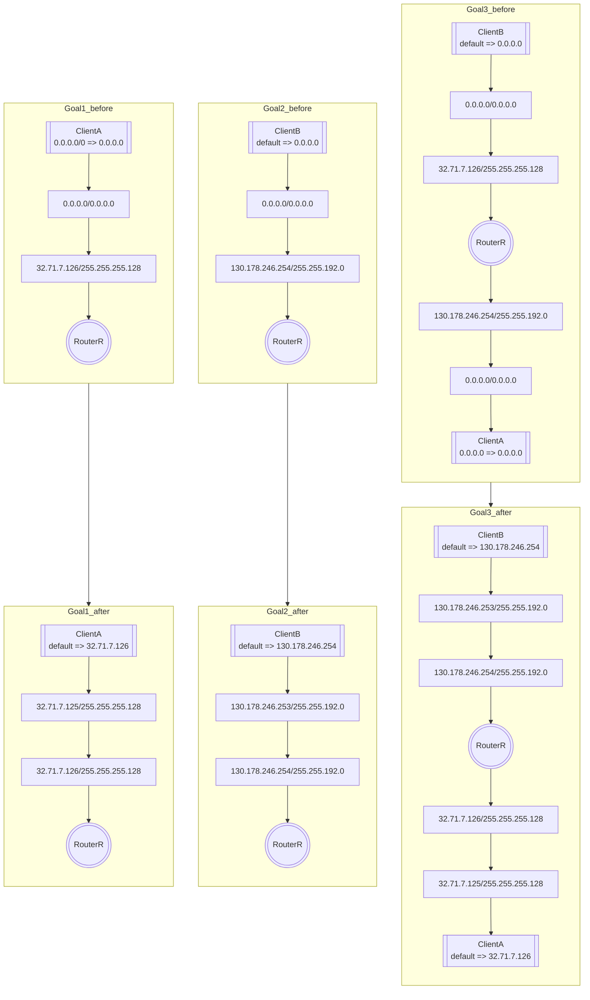

# level5

## Goal1
* ***InterfaceA1***に***InterfaceR1***と同じサブネットマスクを設定する。（省略）
* 既にIPアドレスが設定されている***InterfaceR1***とネットワークアドレスは一致し、ホストアドレスが異なるIPアドレスを***InterfaceA1***に設定する。
* ***ClientA***のデフォルトゲートウェイに***InterfaceR1***のIPアドレスを設定する。

## Goal2
* ***InterfaceB1***に***InterfaceR2***と同じサブネットマスクを設定する。（省略）
* 既にIPアドレスが設定されている***InterfaceR2***とネットワークアドレスは一致し、ホストアドレスが異なるIPアドレスを***InterfaceB1***に設定する。
* ***ClientB***のデフォルトゲートウェイに***InterfaceR2***のIPアドレスを設定する。

## Goal3
* ***InterfaceR1***側と***InterfaceR2***側のネットワークアドレスが別になるように調節する。

## chart

## example

