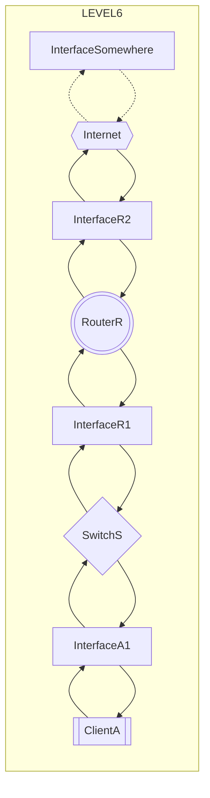
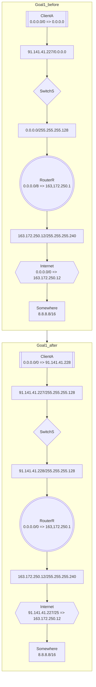

# level6

## Goal1
* ***InterfaceA1***に***InterfaceR1***と同じサブネットマスクを設定する。（省略）
* ***InterfaceR1***に***InterfaceA1***ネットワークアドレスが同じでホストアドレスが異なるIPアドレスを設定する。
* ***ClientA***のデフォルトゲートウェイに***InterfaceR1***のIPアドレスを設定する。
* ***RouterR***のデフォルトゲートウェイに***InterfaceR2***のIPアドレスを設定する。
* ***Internet***から内部ネットワークへの送り先アドレスに***InterfaceA1***と同じネットワークアドレスの値と同じサブネットマスクの値を設定する。

<!-- %%{init:{'theme': 'dark'}}%% -->
<!-- %%{init:{'flowchart': {'curve': 'natural'}}}%% -->
## chart

<!-- %%{init:{'theme': 'dark'}}%% -->
<!-- %%{init:{'flowchart': {'curve': 'natural'}}}%% -->
## example

