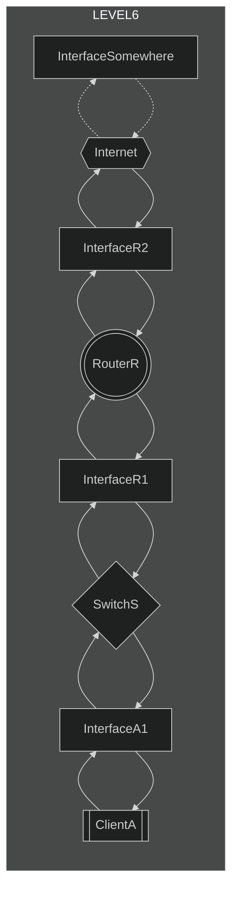
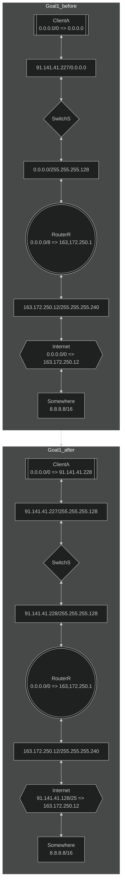

# level6

## How to solve
### Goal1
* ***InterfaceA1***に***InterfaceR1***と同じサブネットマスクを設定する。（省略）
* ***InterfaceR1***に***InterfaceA1***ネットワーク部が同じでホスト部が異なるIPアドレスを設定する。
* ***ClientA***のデフォルトルートに***InterfaceR1***のIPアドレスを設定する。
* ***Internet***から内部ネットワークへの送り先ネットワークアドレスに***InterfaceA1***と同じネットワークアドレス値を設定する。

## chart

## example

