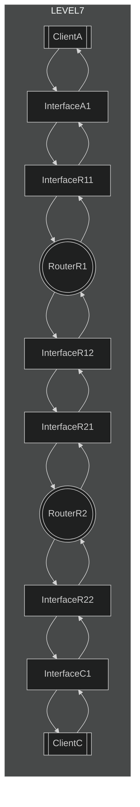

# level7

## Goal1
* 全てのInterfaceに共通したサブネットマスクを持たせる。（省略）level7では、***InterfaceA1***と***InterfaceR11***が属するネットワークと、***InterfaceR12***と***InterfaceR21***が属するネットワークと、***InterfaceC1***と***InterfaceR22***が属する３ネットワークで１ネットワークに２つのIPを付与できるネットワークアドレスを付ければいいので、サブネットマスクを４つ作れる/30(255.255.255.248)を設定。
* ***InterfaceA1***に***InterfaceR11***と同じネットワークアドレスで異なるホストアドレスのIPアドレスを設定する。
* ***ClientA***のデフォルトゲートウェイに***InterfaceR11***のIPアドレスを設定する。
* ***InterfaceR21***に***InterfaceR12***と同じネットワークアドレスで異なるホストアドレスのIPアドレスを設定する。
* ***RouterR1***のデフォルトゲートウェイに***InterfaceR21***のIPアドレスを設定する。
* ***RouterR2***のデフォルトゲートウェイに***InterfaceR12***のIPアドレスを設定する。
* ***InterfaceC1***と***InterfaceR22***に他のネットワークのネットワークアドレスと異なるネットワークアドレスで、且つ、互いにホストアドレスの異なるIPアドレスを設定する。
* ***ClientC***のデフォルトゲートウェイに***InterfaceR22***のIPアドレスを設定する。

## chart

## example

```mermaid
%%{init:{'theme': 'dark'}}%%
flowchart
Goal1_before-->Goal1_after
subgraph Goal1_before
    direction TB
    BE_CL_A[[ClientA<br>0.0.0.0/0 => 0.0.0.0]]
    BE_CL_C[[ClientC<br>0.0.0.0/0 => 0.0.0.0]]
    BE_RR1(((RouterR1<br>0.0.0.0/0 => 0.0.0.0)))
    BE_RR2(((RouterR2<br>0.0.0.0/0 => 0.0.0.0)))
    BE_IF_A[0.0.0.0/0.0.0.0]
    BE_IF_C[0.0.0.0/0.0.0.0]
    BE_IF_R11[107.198.14.1/0.0.0.0]
    BE_IF_R12[107.198.14.254/0.0.0.0]
    BE_IF_R21[0.0.0.0/0.0.0.0]
    BE_IF_R22[0.0.0.0/0.0.0.0]
    BE_CL_A<-->BE_IF_A<-->BE_IF_R11<-->BE_RR1<-->BE_IF_R12<-->BE_IF_R21<-->BE_RR2<-->BE_IF_R22<-->BE_IF_C<-->BE_CL_C
end

subgraph Goal1_after
    direction TB
    AF_CL_A[[ClientA<br>0.0.0.0/0 => 107.198.14.1]]
    AF_CL_C[[ClientC<br>0.0.0.0/0 => 107.198.14.129]]
    AF_RR1(((RouterR1<br>0.0.0.0/0 => 107.198.14.253)))
    AF_RR2(((RouterR2<br>0.0.0.0/0 => 107.198.14.254)))
    AF_IF_A[107.198.14.2//30]
    AF_IF_C[107.198.14.130//30]
    AF_IF_R11[107.198.14.1//30]
    AF_IF_R12[107.198.14.254//30]
    AF_IF_R21[107.198.14.253//30]
    AF_IF_R22[107.198.14.129//30]
    AF_CL_A<-->AF_IF_A<-->AF_IF_R11<-->AF_RR1<-->AF_IF_R12<-->AF_IF_R21<-->AF_RR2<-->AF_IF_R22<-->AF_IF_C<-->AF_CL_C
end
```

