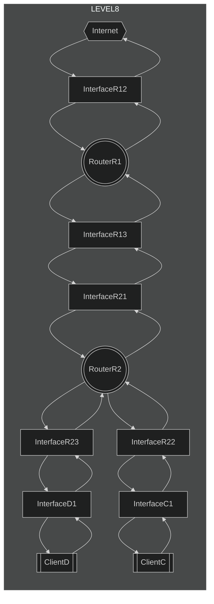
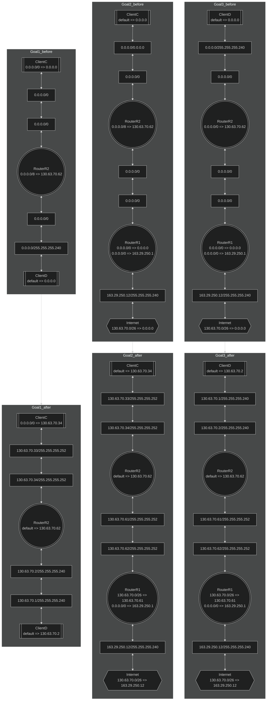

# level8

## How to solve
### Goal1
* 全てのサブネットマスクを255.255.255.240(/28)に統一する。（省略）
* ***ClientC***側のネットワーク、***ClientD***側のネットワーク、***InterfaceR21***側のネットワークのそれぞれ別々のネットワーク部で同一ネットワーク内では別々のホスト部を設定する。 注意点として、***Internet***が内部ネットワークへの返却アドレスとして指定しているサブネットマスクに/26が設定されており、***InterfaceD1***でサブネットマスクに255.255.255.240(/28)が設定されているため、二進数で上位26bitは共通で上位28bitがそれぞれのネットワークで異なる必要がある。
    * 例
        * 11111111.1111111.1111111.1100111
        * 11111111.1111111.1111111.1101111
        * 11111111.1111111.1111111.1110111
    * 上記の３つのIPアドレスは上位26bitは共通したビット列であるが、上位28bitは全て異なるビット列となる。
* ***ClientC***のデフォルトルートに***InterfaceR22***のIPアドレスを設定する。
* ***ClientD***のデフォルトルートに***InterfaceR23***のIPアドレスを設定する。

### Goal2
* ***RouterR1***の一つ目のデフォルトルートを***Internet***の内部ネットワークへの返却アドレスとして設定されているIPアドレスとサブネットマスク==>***InterfaceR21***のIPアドレスへの設定にする。
* ***Internet***の内部ネットワークへの返却アドレス設定に***InterfaceR12***のIPアドレスを設定する。

### Goal3
* Goal1,Goal2の設定ができていればOK

## chart

## example

