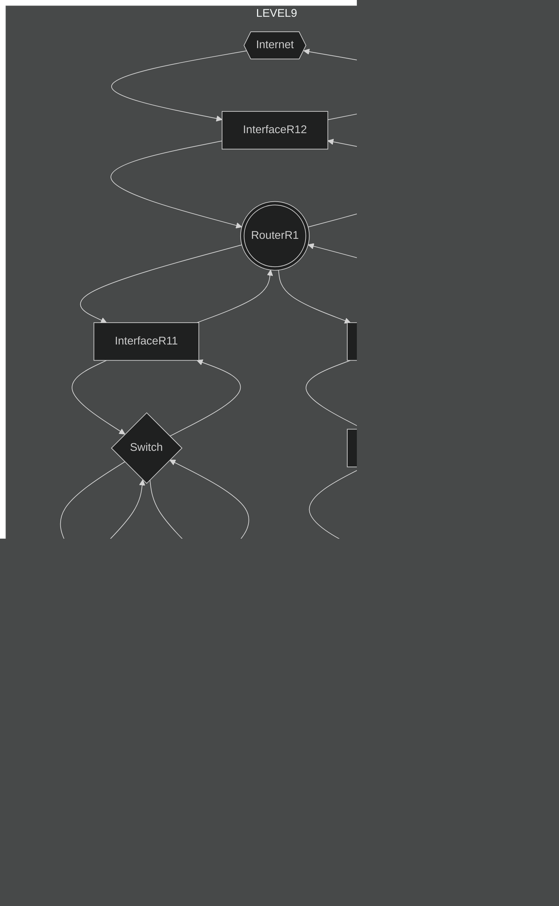

# level9

## How to solve
### Goal1
* ***InterfaceA1***,***InterfaceB1***のサブネットマスクを***InterfaceR11***のサブネットマスクに合わせる。（省略）
* ***InterfaceA1***,***InterfaceB1***,***InterfaceR11***それぞれにネットワーク部が同じでホスト部が異なるIPアドレスを設定する。
* ***ClientA***と***ClientB***のデフォルトルートに***InterfaceR11***のIPアドレスを設定する。

### Goal2
* ***InterfaceC1***,***InterfaceD1***,***InterfaceR22***のサブネットマスクを***InterfaceR23***のサブネットマスク/18に合わせる。（省略）
* ***InterfaceR23***のIPアドレスを***ClientD***のデフォルトルートのIPアドレスに設定する。***InterfaceD1***のIPアドレスを***InterfaceR23***のIPアドレスと異なるネットワーク部で、且つ、同一のホスト部に設定する。
* ***InterfaceC1***の属するネットワークが***ClientD***の属するネットワークとサブネットマスク/18においてネットワーク部が別々になり、且つ、/17においてネットワーク部が一致するIPアドレスを設定し、それぞれのネットワークでホスト部は異なるIPアドレスを設定する。
* ***ClientC***のデフォルトルートを***InterfaceR22***のIPアドレスに、のIPアドレスに設定する。

### Goal3
* ***Internet***のデフォルトルート設定に***InterfaceR11***,***ClientC***,***ClientD***のネットワークを設定する。
* ***RouterR1***のデフォルトルート設定に、***InterfaceR11***の属するネットワーク向けのパケット => ***InterfaceR11***,***ClientC***,***ClientD***の属するネットワーク向けのパケット => ***InterfaceR21***を設定する。注意点として、***ClientC***,***ClientD***の属するネットワーク向けのパケットのサブネットの値は、/17とする。(Goal2で/17によって上手くルーティングされるように設定している)

### Goal4
* ***InterfaceR21***と***InterfaceR13***のサブネットマスク、ネットワーク部を一致させ、ホスト部が異なるIPアドレスを設定する。
* ***RouterR2***のデフォルトルートを***InterfaceR13***のIPアドレスに設定する。

### Goal5, Goal6
Goal1, Goal2, Goal3, Goal4で正しく設定できていればOK

## chart

## example

